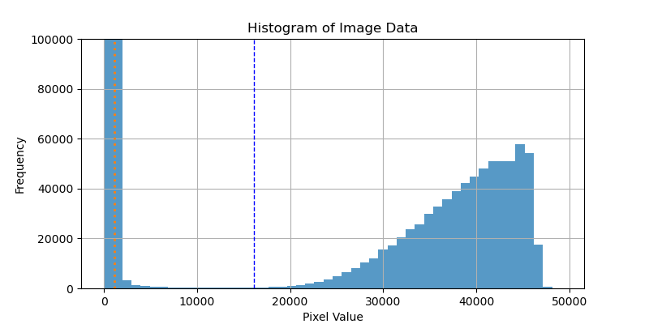

# sun_2024
Solar Observation Report in 2024

## 1. Gathering data
- 48 data collected from September 10, 2024 to February 13, 2025

## 2. Analysis with python & packages

- astropy, opencv, skimage, etc

