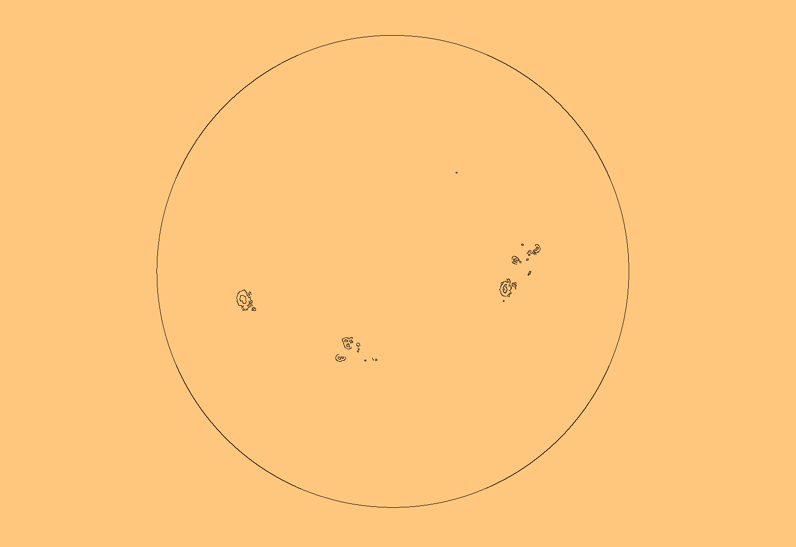
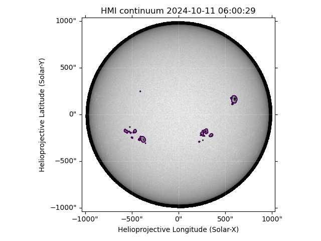
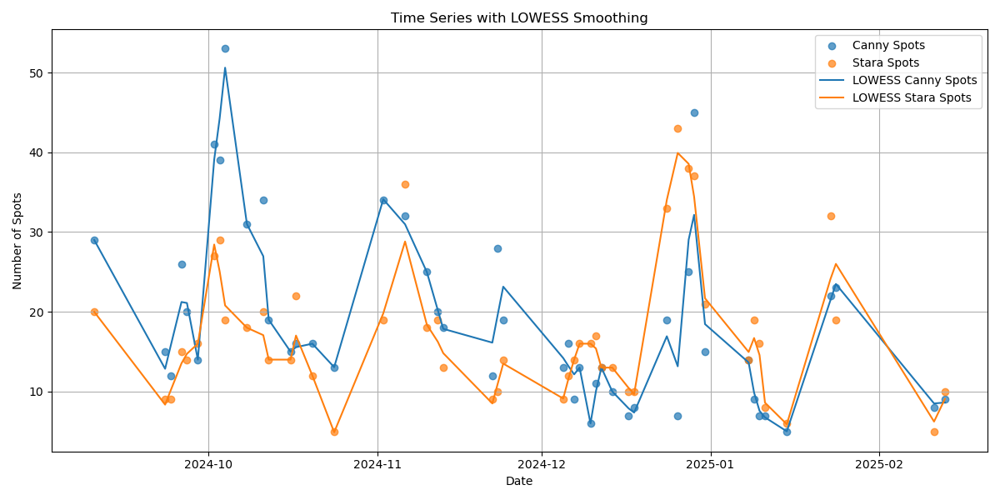
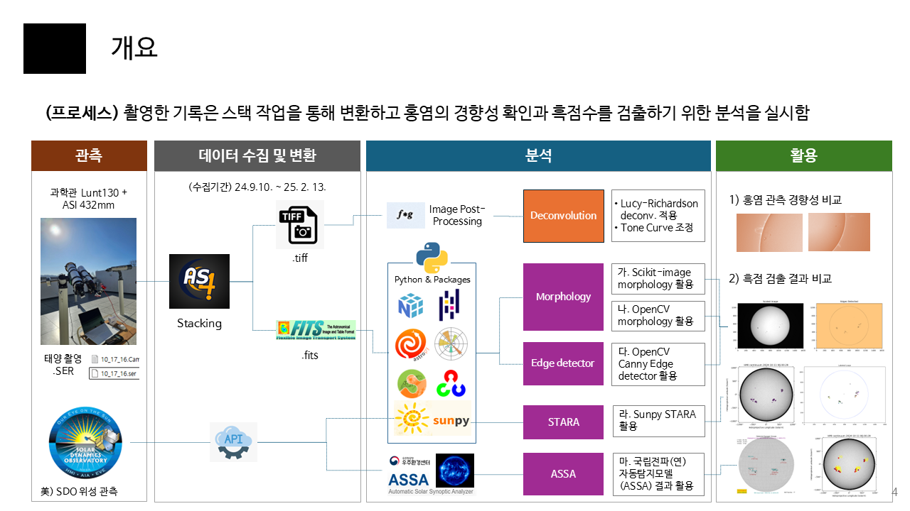

# sun_2024
Solar Observation Report in 2024

## 1. Data gathering
- 48 data collected from September 10, 2024 to February 13, 2025

## 2. Analysis with python & python packages

- astropy, opencv, skimage, etc.

## 3. Sunspots detecting and comparing

- Comparing the results of the morphology, Canny Edge detector, STARA and ASSA
  + **(morphology, Edge detector)** Using functions provided by skimage, opencv package
  + **(STARA)** Using functions provided by the sunpy package
  + **(ASSA)** Refer to the results on the webpage `https://spaceweather.kasa.go.kr/flare.do`

## 4. Visualizing the trends of sunspots

- Time Series with LOWESS smoothing of sunspots

## 5. Summary and Reporting

